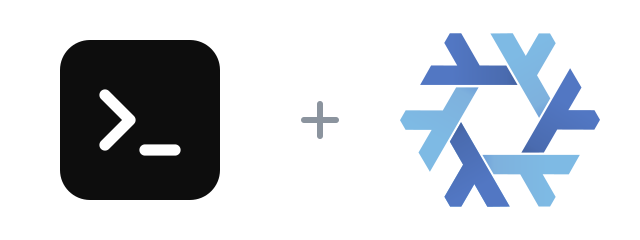

<p align="center">
  
</p>

<h1 align="center">opencode-flake</h1>

<p align="center">
  <a href="flake.nix"></a>
  <a href="LICENSE"></a>
  <a href="https://github.com/sst/opencode/releases/tag/v1.18.34"></a>
</p>

[opencode](https://github.com/sst/opencode) is an AI coding agent built for the terminal.

This flake packages the official prebuilt Linux binary from the upstream release rather than building the Bun and TypeScript sources, so there is no Bun toolchain or npm install step. `ripgrep`, which opencode shells out to for search, is supplied declaratively. It supports x86_64 and ARM64 Linux.

```sh
nix run github:Fractal-Tess/opencode-flake -- --version
```

Build it without running:

```sh
nix build github:Fractal-Tess/opencode-flake#opencode
```

## Install in a Nix configuration

Add the flake input:

```nix
inputs.opencode-flake.url = "github:Fractal-Tess/opencode-flake";
```

Use the NixOS module:

```nix
{
  imports = [ inputs.opencode-flake.nixosModules.default ];
  programs.opencode.enable = true;
}
```

Home Manager already ships a `programs.opencode` module that manages settings, agents, commands, and themes. Redeclaring those options here would collide, so this flake's Home Manager module only points that module at this package:

```nix
{
  imports = [ inputs.opencode-flake.homeManagerModules.default ];
  programs.opencode.enable = true;
}
```

The default overlay is available when you prefer `pkgs.opencode`:

```nix
{
  nixpkgs.overlays = [ inputs.opencode-flake.overlays.default ];
  environment.systemPackages = [ pkgs.opencode ];
}
```

Because the package is immutable, update it through the flake rather than with `opencode upgrade`.

opencode keeps its own configuration, credentials, and session data outside the store; installing this package does not manage or migrate that data.

## Update

The daily [update workflow](.github/workflows/update.yml) runs at 12:00 UTC, checks the latest stable release, refreshes both Linux hashes, validates the package, and commits an update. Run the same process locally with:

```sh
./scripts/update.sh
```

Pass a stable version such as `./scripts/update.sh 1.18.34` to update to a specific release. The workflow can also be started manually from GitHub Actions.

## Credits and mirrors

[GitHub](https://github.com/Fractal-Tess/opencode-flake) · Gitadel: `ssh://git@neo.netbird.cloud:2222/fractal-tess/opencode-flake.git`

The flake packaging is [MIT](LICENSE). opencode is [MIT licensed](https://github.com/sst/opencode/blob/dev/LICENSE); the upstream notice reads "Copyright (c) 2025 opencode", covering the opencode authors. The runtime wrapping follows the [nixpkgs `opencode` derivation](https://github.com/NixOS/nixpkgs/tree/master/pkgs/by-name/op/opencode).

The lockup pairs a stylized terminal prompt glyph drawn for this lockup — not an official opencode asset — with the [Nix snowflake](https://github.com/NixOS/nixos-artwork/tree/master/logo) by Simon Frankau and Tim Cuthbertson ([CC BY 4.0](https://creativecommons.org/licenses/by/4.0)), resized and arranged here. The opencode authors are not affiliated with or endorsing this flake.
